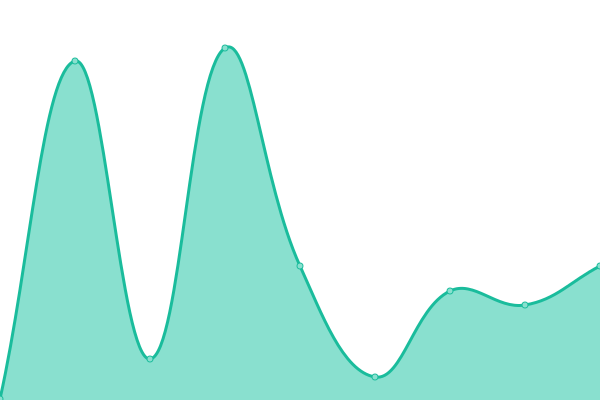
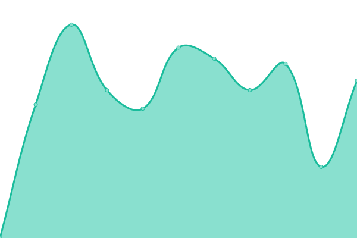

# [📈 Live Status](https://BilelJegham.github.io/status): <!--live status--> **🟩 All systems operational**

This repository contains the open-source uptime monitor and status page for [Bilel Jegham](https://BilelJegham.github.io/status), powered by [Upptime](https://github.com/upptime/upptime).

With [Upptime](https://upptime.js.org), you can get your own unlimited and free uptime monitor and status page, powered entirely by a GitHub repository. We use [Issues](https://github.com/BilelJegham/status/issues) as incident reports, [Actions](https://github.com/BilelJegham/status/actions) as uptime monitors, and [Pages](https://BilelJegham.github.io/status) for the status page.

<!--start: status pages-->
<!-- This summary is generated by Upptime (https://github.com/upptime/upptime) -->
<!-- Do not edit this manually, your changes will be overwritten -->
<!-- prettier-ignore -->
| URL | Status | History | Response Time | Uptime |
| --- | ------ | ------- | ------------- | ------ |
|  [GeoGuess](https://geoguess.games/) | 🟩 Up | [geo-guess.yml](https://github.com/BilelJegham/status/commits/HEAD/history/geo-guess.yml) | 

 372ms
     
 | 

<a href="https://BilelJegham.github.io/status/history/geo-guess">100.00%</a>
    

|  [GeoGuess Demo](https://demo.geoguess.games/) | 🟩 Up | [geo-guess-demo.yml](https://github.com/BilelJegham/status/commits/HEAD/history/geo-guess-demo.yml) | 

 200ms
     
 | 

<a href="https://BilelJegham.github.io/status/history/geo-guess-demo">100.00%</a>
    

|  [Aile Editions](https://www.aile-editions.com/) | 🟩 Up | [aile-editions.yml](https://github.com/BilelJegham/status/commits/HEAD/history/aile-editions.yml) | 

 4440ms
     
 | 

<a href="https://BilelJegham.github.io/status/history/aile-editions">99.83%</a>
    

<!--end: status pages-->

[**Visit our status website →**](https://BilelJegham.github.io/status)

## 📄 License

- Powered by: [Upptime](https://github.com/upptime/upptime)
- Code: [MIT](./LICENSE) © [Bilel Jegham](https://BilelJegham.github.io/status)
- Data in the `./history` directory: [Open Database License](https://opendatacommons.org/licenses/odbl/1-0/)
